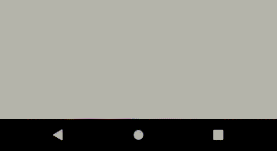

# easynotificationview
[  ](https://bintray.com/voobshenetfantazii/maven/EasyNotificationView/0.1/link)

This small kotlin library helps you to show fully customizable notifications in any part of your app without the need to write any boilerplate code.
```kotlin
EasyNotificationView.create(this, R.layout.layout_for_notification).show()
```
In this case you will see smth like this:



### Adding to the project
Add to the dependencies section:
```
implementation 'com.netfantazii:EasyNotificationView:0.1'
```
Make sure, that the project's build.gradle file has the following repositoriy specified (it is included in new android studio projects by default):
```
jcenter()
```

### How to customize the notification layout?
Just pass what layout you like to the create function.
### How to customize the animation?
I've created a couple of basic animations. You can add them this way:
```kotlin
        EasyNotificationView.create(
            this,
            R.layout.layout_for_notification,
            appearAnimator = FadeInAppearAnimator(),
            disappearAnimator = BottomSlideDisappearAnimator()
        ).show()     
```
You can easily create your animation and animate any parameters you want. Just inherit from basic Appear or Disappear animator class and implement required functions.
You can see the example in created animations.

### Changing the default container for the notification.
By default, the container used for the notification is the root view of the context, which is passed in the create function. In this case, you must pass either fragment or activity context, not the application one, because the application context doesn't have an associated layout with it.
If you want to change this behavior, you can pass a container to the show() function. Doing this you are no more restricted in using activity or fragment context and can use the
application one.
```kotlin
        val container = findViewById<FrameLayout>(R.id.container)
        EasyNotificationView.create(this, R.layout.layout_for_notification).show(container)
```
### Listeners
The notification supports up to 9 buttons plus background click behavior. The buttons in your layout file must have following ids: env_button1, env_button2, ...env_button9.
```xml
        <TextView
            android:id="@+id/env_button1"
            android:text="Sample button 1" />
        
        <TextView
            android:id="@+id/env_button2"
            android:text="Sample button 2" />
        
        <TextView
            android:id="@+id/env_button9"
            android:text="Sample button 9" />
```
After defining ids, use the appropriate setter to attach the listener:
```kotlin
EasyNotificationView.create(this, R.layout.layout_for_notification).apply {
            onButton3ClickListener = {
                greatFunction()
                hide()
            }

            onButton7ClickListener = {
                anotherGreatFunction()
                hide()
            }
        }.show()
```
By default all the buttons except the background overlay have hide() behavior. Clicking on them will start disappear animation and finally close the notification.

### Changing the overlay color and behavior
Just pass the color as the third argument and apply the onOverlayClickListener.
```kotlin
        val overlayColor = ContextCompat.getColor(this, R.color.colorPrimary)
        EasyNotificationView.create(this, R.layout.layout_for_notification, overlayColor).apply {
            onOverlayClickListener = {
                onOverlayClickFunction()
            }
        }.show()
```
By default, the overlay swallows all clicks, but you can make it to propagate them to the underlying views. To do that, define isOverlayClickable property as 'false' and to not
apply any listeners to the overlay.
```kotlin
        EasyNotificationView.create(this, R.layout.layout_for_notification).apply {
            isOverlayClickable = false
        }.show()
```
Passing the transparent color and disabling overlay clickability will make the overlay disappear.
```kotlin
        EasyNotificationView.create(this, R.layout.layout_for_notification, Color.TRANSPARENT).apply {
            isOverlayClickable = false
        }.show()
```
### Under the hood behavior
The notification view attaches itself to the container when you call the show() method. After the disappear animation finishes, the notification view automatically detaches itself from the root view.
